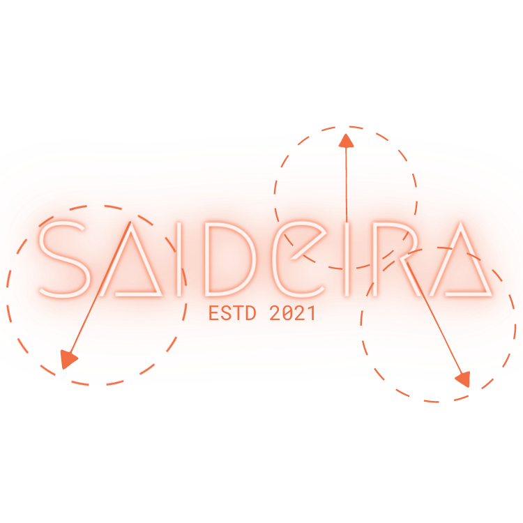
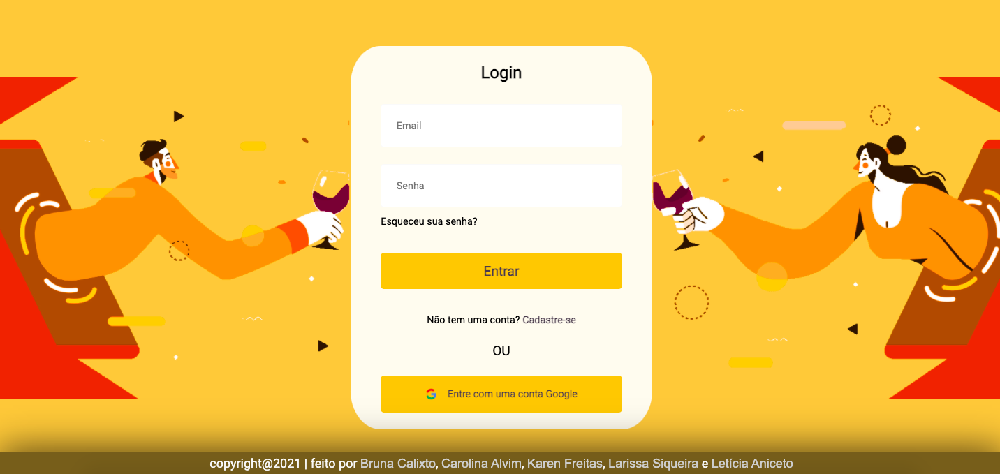
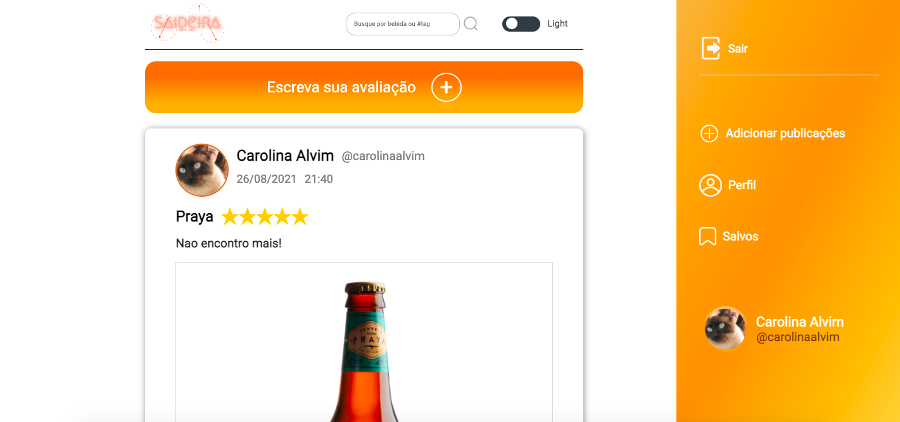
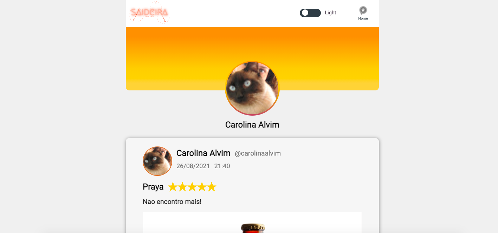
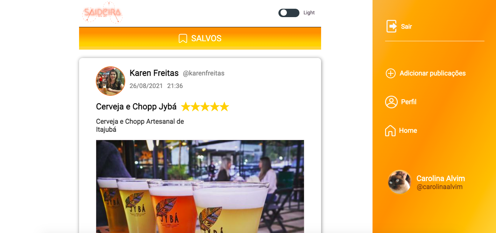
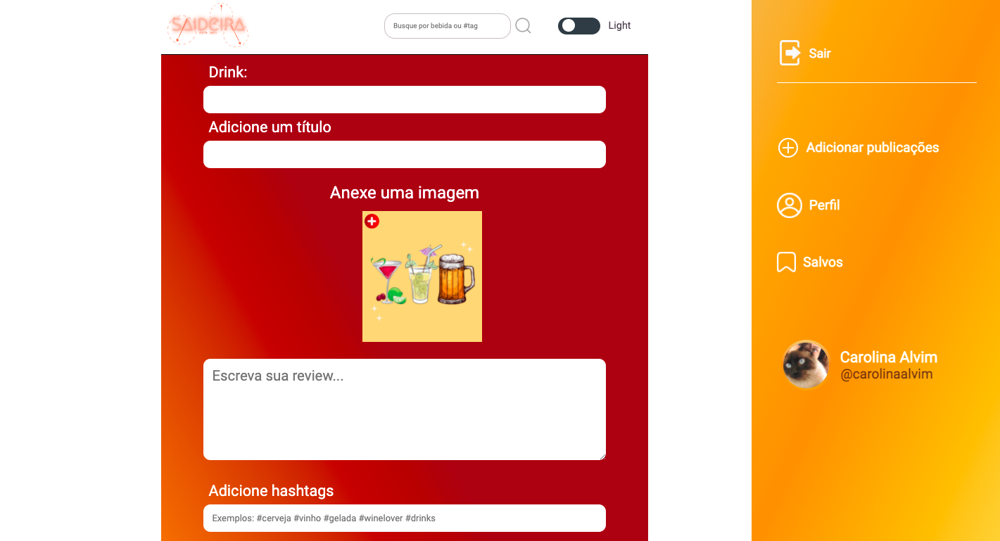

# Saideira - A Rede Social para amantes dos bons drinks

“Saideira” é uma rede social que busca conectar amigos através dos Bons Drinks. Nossa rede tem como publico alvo maiores de 18 anos e amantes de cervejas, vinhos e drinks em geral. Para visualizar a aplicação, acesse [aqui.](https://bit.ly/Saideira-social-network)

  
   

---
## Índice

- [1. Introdução](#1-introdução)
- [2. Histórias de Usuário](#2-histórias-de-usuário)
- [3. Interface](#3-interface)
- [4. Objetivos de aprendizagem](#4-objetivos-de-aprendizagem)
- [5. Desenvolvedoras](#5-desenvolvedoras)

---
## 1. Introdução

Instagram, Snapchat, Twitter, Facebook, Twitch, Linkedin, etc. As redes sociais
invadiram nossas vidas. Nós as amamos ou odiamos, e muitas pessoas não conseguem
viver sem elas.

Há redes sociais de todo tipo para todos os tipos de interesse. Por exemplo: em
uma rodada de financiamento com investidores, foi apresentada uma rede social
para químicos onde os usuários podem publicar artigos a respeito de suas
pesquisas, comentar os artigos de seus colegas e filtrar artigos de acordo com
determinadas tags ou popularidade, mais recente ou mais comentado.

Nesse projeto, foi solicitada a criação de uma rede social que permitisse à qualquer usuário criar uma conta de acesso,
logar-se com ela, criar, editar, deletar e dar _likes_ em publicações.

## 2. Histórias de Usuário

Saideira é uma rede social direcionada a pessoas maiores de 18 anos e que gostariam de compartilhar experiências, opiniões e dicas sobre vinhos, cervejas e drink. Para atender às necessidades desse público, foram priorizadas três histórias de usuários, expostas a seguir juntamente com seus critérios de aceitação. Além dos critérios listados, todas as histórias deveriam ser Single Page Applications (SPA) e responsivas.

### História de Usuário 1 

:pushpin: *Como apreciador de bebidas variadas, gostaria de me cadastrar em uma rede social direcionada a esse tema, para que possa ter acesso à conteúdos específicos, como receitas de drinks e recomendações de novas bebidas.*

**Critérios de aceitação**

- [x]  Novos usuários podem registrar-se usando um e-mail ou uma conta Gmail.
- [x]  Não poderá ser feito o cadastro de usuários repetidos.
- [x]  Somente usuários com contas válidas têm acesso permitido.
- [x]  A conta do usuário deve ser um email válido.
- [x]  O que o usuário digita no campo de senha (*input*) deve ser secreto.

### História de Usuário 2

:pushpin: *Como usuário de uma rede social para trocas de experiencias, quero avaliar as bebidas que consumi com estrelas e pequenas resenhas para compartilhar com outros usuários da rede.*

**Critérios de Aceitação**

- [x]  Conseguir publicar um *post*.
- [x]  Poder excluir uma postagem específica.
- [x]  Solicitar confirmação antes de excluir um *post*.
- [x]  Ao clicar em editar um *post*, permitir que o usuário edite o texto e salve as alterações.
- [x]  Ao salvar as alterações, voltar ao texto normal, mas com a informação editada.
- [x]  Ao recarregar a página, poder ver os textos editados.
- [x]  Possibilitar incluir imagens nas resenhas.

### História de Usuário 3

:pushpin: *Como usuário de uma rede social para bebidas, gostaria de interagir nas publicações e resenhas de outros usuários, para desenvolver novos entendimentos sobre bebidas em geral e expor minhas opiniões.*

**Critérios de aceitação**

- [x]  Poder dar e remover *likes* em uma publicação. Máximo de um por usuário.
- [x]  Visualizar contagem de *likes*.
- [x]  Postar e comentários nas publicações .
- [x]  Excluir os próprios comentários.
- [x]  Pesquisar posts.

## 3. Interface

### Layout Final

## 4. Objetivos de Aprendizagem

O objetivo principal de aprendizagem deste projeto foi construir uma [Single-page Application(SPA)](https://pt.wikipedia.org/wiki/Aplicativo_de_p%C3%A1gina_%C3%BAnica) responsiva (com mais de uma tela/ página) na qual fosse possível **ler e escrever dados.**

Outro tópico relevante necessário ao desenvolvimento do projeto foi a utilização do [Firebase](https://firebase.google.com/), um *Backend-as-a-Service* - **BaaS** - do Google, usado para facilitar o desenvolvimento de aplicativos web ou móveis. 

## 5. Desenvolvedoras

:woman_technologist: [Bruna Calixto](https://github.com/bruna-devbio)

:woman_technologist: [Carolina Alvim](https://github.com/caroAlvim)

:woman_technologist: [Larissa Siqueira](https://github.com/LarissaSiq)

:woman_technologist: [Leticia Aniceto](https://github.com/leticia-aniceto)

:woman_technologist: [Karen Freitas](https://github.com/karen-freitas)
